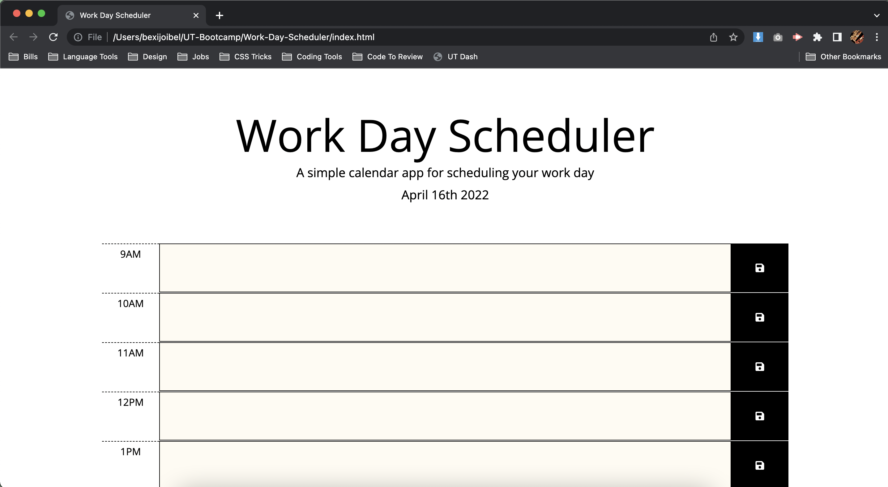

# Work-Day-Scheduler

## User Experience

I created an work day application. In this app, the user can utilize this page as a daily work scheduler. They are able to use the text fields and notate entries and save them. Once the user refresher the page, the entries stay as they are being logged in local storage. 

The hours are also color coded so that they user can know the past, present, and future hours. 

## Mock-Up

The following animation demonstrates the application functionality:

## Development Link

